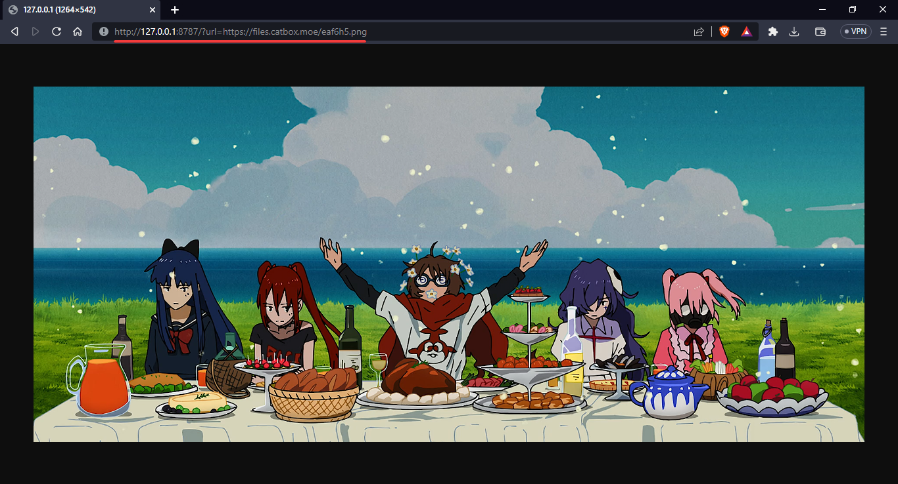

<div>
    <h1 align="center">cfw-proxy</h1>
</div>

<br>

<h2>Requirements</h2>

- **wrangler**
- **Node.js**

<h2>Installation</h2>

Configure name of the project in `wrangler.toml` file

```shell
$ npx wrangler publish
```

<h2>Usage</h2>

Get any url: `https://xxx.worker.dev?url=https://example.com/image.png`



<h2>Warning: Some things need to be considered</h2>

 - Cloudflare can trigger video file as stream and lock access to video
